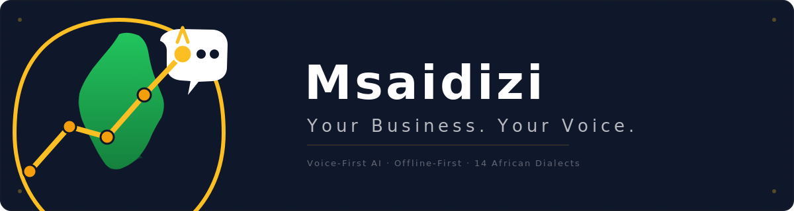

[](https://github.com/ovalentine964/Msaidizi-app/actions/workflows/build.yml)

# Msaidizi — The AI Employee for Africa's 600M+ Informal Workers

**Not an assistant. A CFO. Proactive, voice-first, offline-first. Speaks your language.**

**Version:** 0.3.0 | **Last Updated:** July 8, 2026

---

## What Is Msaidizi?

Msaidizi is the on-device AI CFO for informal workers — the one team member they never could afford. Every informal worker has an AI CFO that speaks their language, tracks their money, and helps them build wealth.

### Core Features
- 🎤 **Voice-first** — record transactions by speaking in your language
- 📴 **Offline-first** — works without internet, syncs when connected
- 🧑‍💼 **CFO, not assistant** — proactive daily briefings, cash flow forecasting, credit readiness
- 🌍 **14 dialects** — Swahili, Sheng, Kikuyu, Dholuo, Luhya, Kalenjin, Maasai, Somali, Amharic, Yoruba, Igbo, Hausa, Zulu, Xhosa
- 📊 **Business Flow** — M-Pesa-style cash flow visualization
- 🎮 **Gamification** — points, levels, streaks, badges for healthy financial habits
- 💰 **Wealth Mindset** — 10 daily "Rich Habits" tracking
- 🤲 **Tithe & Giving** — track tithes and charitable giving
- 🎯 **Goals & Loans** — savings goals and loan repayment tracking
- 🔒 **Bank-grade security** — AES-256-GCM, TLS 1.3, post-quantum cryptography ready

---

## Architecture

```
📱 Msaidizi App (Android)
├── Voice-first (14 African dialects)
├── Offline-first
├── On-Device AI (Qwen 0.5B via llama.cpp NDK)
├── Multi-Agent System (7 agents, 6 focused handlers)
├── Federated Learning
├── Smart Onboarding (voice conversation)
├── WhatsApp Integration (OpenWA)
└── 242 Kotlin source files

☁️ Angavu Intelligence Backend (Python)
├── 33+ AI Agents across 6 swarms
├── Event Bus Architecture (Redis Streams)
├── Domain-Specific Agents (8 domains)
├── Intelligence Pipeline (real services)
├── Federated Learning Service
├── Prometheus Metrics (30 metrics)
├── One-Command Oracle Cloud Deploy
└── 318 Python source files
```

---

## Tech Stack

| Layer | Technology | Why |
|-------|-----------|-----|
| **Mobile** | Kotlin 2.1.0, Jetpack Compose, Room 2.7.1, Hilt | Native Android, modern UI, offline storage |
| **On-Device AI** | llama.cpp NDK, Qwen 0.5B, Whisper, Piper TTS | $0 inference, works offline, ARM-optimized |
| **Backend** | Python 3.12, FastAPI, Gunicorn (4 workers) | Async-first, ML ecosystem, rapid development |
| **Database** | PostgreSQL 16, Redis 7, ClickHouse | OLTP, caching, analytics |
| **Infrastructure** | Docker, Oracle Cloud, Nginx | One-command deploy, $0 Free Tier |
| **Security** | AES-256-GCM, TLS 1.3, ML-KEM, ML-DSA, JWT RS256 | Bank-grade + quantum-ready |
| **WhatsApp** | OpenWA (self-hosted) | Free, no Meta approval, full control |
| **Monitoring** | Prometheus, structlog, Sentry | 30 metrics, structured logging |

---

## Quick Start

### One-Command Deploy (Oracle Cloud)
```bash
curl -sSL https://raw.githubusercontent.com/ovalentine964/angavu-intelligence-backend/main/deploy.sh | bash
```

### Manual Setup
```bash
# Backend
cd angavu-intelligence-backend
docker-compose up -d

# App (Android Studio)
cd msaidizi-app
./gradlew assembleDebug
```

---

## Products

| Product | What It Does | Users |
|---------|-------------|-------|
| **Soko Pulse** | Real-time market intelligence — prices, demand, trends | Traders, farmers |
| **Biashara Pulse** | AI CFO — cash flow, costs, daily briefings | All informal workers |
| **Alama Score** | Credit scoring without formal records | Borrowers, lenders |
| **Jamii Insights** | Community-level economic intelligence | Counties, NGOs, policy |

---

## Reports

Workers receive reports at 5 frequencies:

| Frequency | Channel | Content |
|-----------|---------|---------|
| Daily 7 PM | WhatsApp + App | Revenue, expenses, profit, cash flow, insight |
| Weekly Monday 8 AM | WhatsApp + App | Trends, recommendations, business health score |
| Monthly 1st 9 AM | WhatsApp + App | Cash flow statement, income statement, Alama Score |
| 6-Month | WhatsApp + App | Growth trajectory, credit readiness certification |
| Yearly | WhatsApp + App | Tax-ready statements, business valuation |

---

## Academic Framework

Every feature is grounded in Economics & Statistics:

| Feature | Academic Foundation |
|---------|-------------------|
| Price discovery | ECO 101 — Supply/Demand (Akerlof, Stiglitz) |
| Credit scoring | ECO 321 — Information Economics |
| Cash flow tracking | ECO 201 — Producer Theory |
| Market forecasting | STA 244 — Time Series Analysis |
| Business health score | ECO 206 — Microfinance |
| Peer comparison | STA 341 — Estimation Theory |
| Federated learning | STA 142 — Bayesian Inference |

---

## Security

- **AES-256-GCM** field-level encryption (unique IV per field)
- **TLS 1.3** + certificate pinning
- **Post-quantum ready** — ML-KEM (Kyber) + ML-DSA (Dilithium)
- **JWT RS256** with token family theft detection
- **12-layer output sanitization** (XSS, injection, PII masking)
- **Differential privacy** (ε=0.1) for federated learning
- **Zero-knowledge architecture** — data stays on device

---

## Scalability

| Scale | Strategy | Cost |
|-------|----------|------|
| 1K users | Single Oracle Cloud instance | $0 (Free Tier) |
| 10K users | Multi-process Gunicorn + Redis | ~$50-100/mo |
| 100K users | Redis Streams + connection pooling | ~$200-500/mo |
| 1M users | Go API gateway + Python ML | ~$500-1,000/mo |

---

## Research Compendium

221-page thesis-grade research document covering:
- Voice Models, Reasoning Models, Agentic Systems
- Agent Loops, Quantum Computing, AGI Race
- Emerging Systems, Humanity & Ethics
- African Language Training, Missing Degree Units
- Product Taxonomy (43 data products)
- Training Architecture (on-device + cloud)

📄 [ANGAVU_INTELLIGENCE_RESEARCH_COMPENDIUM.pdf](research/ANGAVU_INTELLIGENCE_RESEARCH_COMPENDIUM.pdf)

---

## Founder

**Valentine Owuor** — BSc Economics & Statistics, Masinde Muliro University (December 2026)

*"My mum is a micro retail trader. I watched her from class 1 to university. She's the reason this company exists."*

---

## License

Proprietary — Angavu Intelligence Ltd.

**Built for the workers the world forgot.** 🌍
